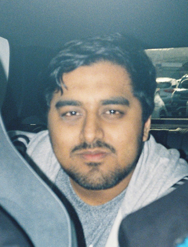

# Personas

## Persona 1

| Name | Age | Sex | Occupancy |
|---|---|---|---|
| Jack Williams | 31 | Male | Office worker |

### Background
Jack is a full time office worker. He wants to lose weight and keep tracking his health conditions and improve them over time. This includes diet plan, exercises, time management and controlling his good and bad habits. He also wishes to workout with his friends, and track short milestones to keep consistency.

### Goals
- Lose weight and improve health conditions over time
- Track diet plan and exercises alongside his daily routine
- Manage time and keep control of good and bad habits
- Track short milestones for consistency
- Workout with friends and track collective progress

### Frustrations and Pain Points
- Loses motivation due to unclarity of short term goals or absence of results
- Loses interest due to poor UI
- Calories tracking might be hard to do throughout the day due to work and other activities
- Unclear policies about whether data is sold to third parties or not
- Might face the problem of understanding medical terms and graphs
- Wants a way for his friends group to track collective progress

### Behaviors
- Uses the app mainly around work hours, usually evenings
- Prefers quick logging because he is busy during the day
- Checks short milestones and progress trends to stay motivated
- More likely to use group features if it is easy to set up and clear what is shared
- Stops using it if the UI is confusing or feels slow

## Persona 2

| Name | Age | Sex | Occupancy |
|---|---|---|---|
| Mary Johnson | 23 | Female | barista and university student |

### Background
Mary is a part time barista and a nursing university student. Her goal is to gain weight while keeping up with work and university work. Due to burnout she struggles with motivation and consistency, and she does not want to complicate her life with a complicated system.

### Goals
- Gain weight to reach a healthier average
- Keep up with work and university coursework
- Maintain progress over time without adding extra stress

### Frustrations and Pain Points
- Motivation and consistency issues, burnout may cause missed logging or missing meals
- Time pressure, she does not want a complicated system
- Progress visibility, if progress is slow or shown poorly she may disengage
- Avoidance when behind, if she misses a few days she may disengage

### Behaviors
- Uses the app in short bursts rather than long sessions
- More likely to log if it is quick and simple
- Can stop logging after missing a few days
- Engages more if the app shows small wins and clear progress

## Persona 3

| Name | Age | Sex | Occupancy |
|---|---|---|---|
| Dave Smith | 29 | Male | Hospitality Worker|

### Background
Dave works in hospitality with long hours. He struggles to stay consistent in the gym and build muscle, so he is looking for an app to help him keep track and stay as motivated as possible. He wants to improve his diet and see progress based on how much he goes to the gym monthly.

### Goals
- Build muscle and improve fitness consistency
- Improve diet to support training
- Track gym attendance monthly and see progress over time

### Frustrations and Pain Points
- Bad memory, forgets sessions and struggles to recall consistency
- Low motivation, fatigue and overwork may reduce gym attendance
- Inconsistent routine, unpredictable shifts make planning difficult
- Underestimates progress, gives up due to perceived lack of progress
- Poor sleep due to inconsistent shifts
- Missed meals, inconsistent hours cause him to miss meals and reduce gains

### Behaviors
- Logs gym sessions mainly when it is quick and easy
- Often forgets to log on busy days
- Checks monthly progress more than daily details
- More likely to use reminders if they fit around his shifts

## Persona 4

| Name | Age | Sex | Occupancy |
|---|---|---|---|
| Tariq Islam | 36 | Male | Technical support |

### Background
Tariq wants to use a health tracker for diet and exercise, but he is cautious about privacy. He does not want unclear policies, and he does not want her data sold to third parties. He wants clear control over communications, and wants the option to avoid groups if he wants.

### Goals
- Track diet and exercise privately
- Understand what data is collected and how it is used
- Control email communications and opt in or opt out
- Use the app without feeling forced into groups or sharing

### Frustrations and Pain Points
- Unclear privacy policies reduce trust
- If the app pushes sharing or group features it puts him off
- Too much required information at registration creates friction
- Confusing health feedback or graphs without explanation is frustrating

### Behaviors
- Reads privacy and consent information before registering
- Uses minimal profile details where possible
- Avoids group features unless it is clearly opt-in and easy to leave
- Stops using the app if policies feel unclear or change unexpectedly
