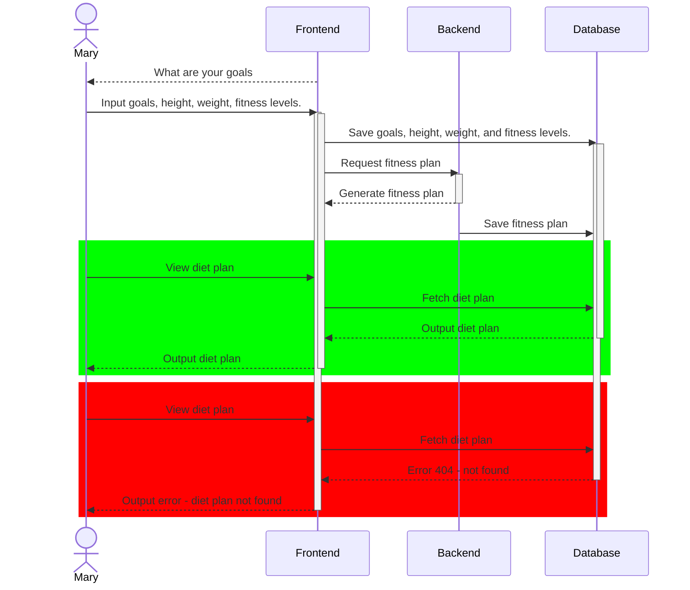
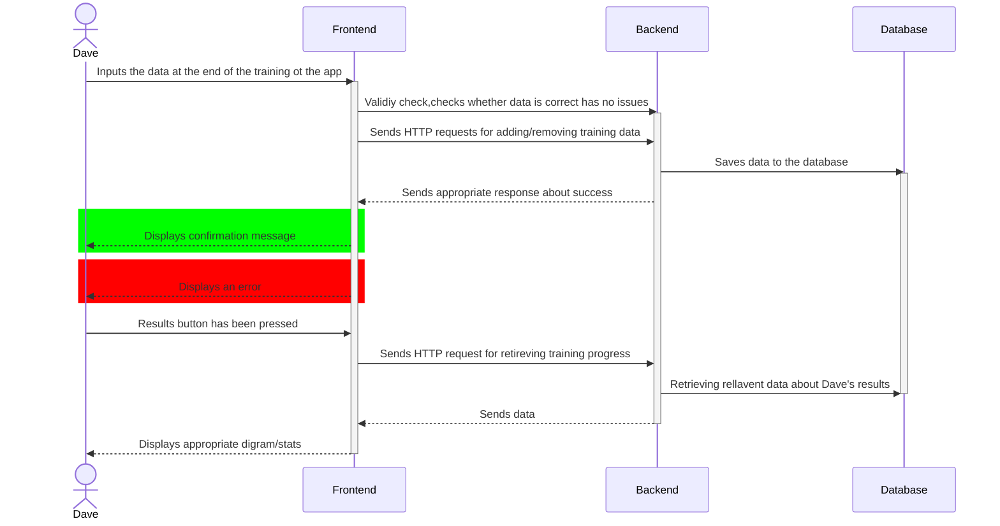
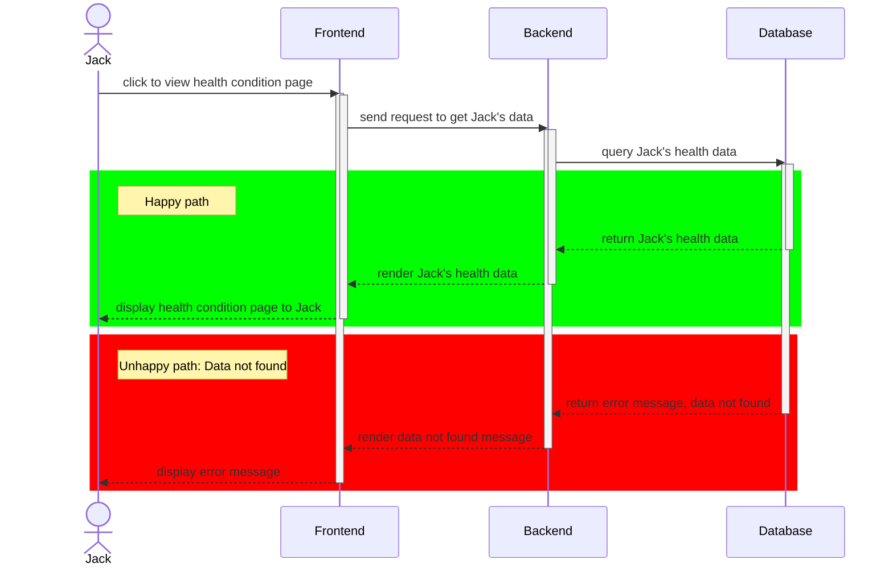

``` mermaid
sequenceDiagram
    actor Mary
    Participant Frontend
    Participant Backend
    Participant Database


    Frontend-->>Mary: What are your goals
    Mary->>Frontend: Input goals, height, weight, fitness levels.
    activate Frontend
    activate Frontend
    Frontend->>Database: Save goals, height, weight, and fitness levels.
    activate Database
    activate Database
    Frontend->>Backend: Request fitness plan
    activate Backend
    Backend-->>Frontend: Generate fitness plan
    deactivate Backend
    Backend->>Database: Save fitness plan

    rect rgb(0,255,0)
    Mary->>Frontend: View diet plan
    Frontend->>Database:Fetch diet plan
    Database-->>Frontend: Output diet plan
    deactivate Database
    Frontend-->>Mary: Output diet plan
    deactivate Frontend
    end

    rect rgb(255,0,0)
    Mary->>Frontend:View diet plan
    Frontend->>Database:Fetch diet plan
    Database-->>Frontend: Error 404 - not found
    deactivate Database
    Frontend-->>Mary: Output error - diet plan not found
    deactivate Frontend
    end
    
```
---

``` mermaid
sequenceDiagram
    actor Dave
    participant Frontend
    participant Backend
    participant Database
    Dave ->> Frontend: Inputs the data at the end of the training ot the app
    activate Frontend
    Frontend ->> Backend: Validiy check,checks whether data is correct has no issues
    activate Backend
    Frontend ->> Backend: Sends HTTP requests for adding/removing training data
    Backend ->> Database: Saves data to the database
    activate Database
    Backend -->> Frontend: Sends appropriate response about success
    rect rgb(0,255,0)
    Frontend -->> Dave: Displays confirmation message
    end
    rect rgb(255,0,0)  
    Frontend -->> Dave: Displays an error
    end
    Dave ->> Frontend: Results button has been pressed
    Frontend ->> Backend: Sends HTTP request for retireving training progress
    Backend ->> Database: Retrieving rellavent data about Dave's results
    deactivate Database
    Backend -->> Frontend: Sends data
    deactivate Backend
    Frontend -->> Dave: Displays appropriate digram/stats
    deactivate Frontend
```

---

```mermaid
sequenceDiagram
    actor Jack
    participant Frontend
    participant Backend
    participant Database
    Jack ->> Frontend: click to view health condition page
    activate Frontend
    activate Frontend
    Frontend ->> Backend: send request to get Jack's data
    activate Backend
    activate Backend
    Backend ->> Database: query Jack's health data
    activate Database
    activate Database
    rect rgb(0, 255, 0)
    Note right of Jack: Happy path
    Database -->> Backend: return Jack's health data
    deactivate Database
    Backend -->> Frontend: render Jack's health data
    deactivate Backend
    Frontend -->> Jack: display health condition page to Jack
    deactivate Frontend
    end
    rect rgb(255, 0, 0)
    Note right of Jack: Unhappy path: Data not found
    Database -->> Backend: return error message, data not found
    deactivate Database 
    Backend -->> Frontend: render data not found message
    deactivate Backend
    Frontend -->> Jack: display error message
    deactivate Frontend
    end
```

    
   
      
    
    
