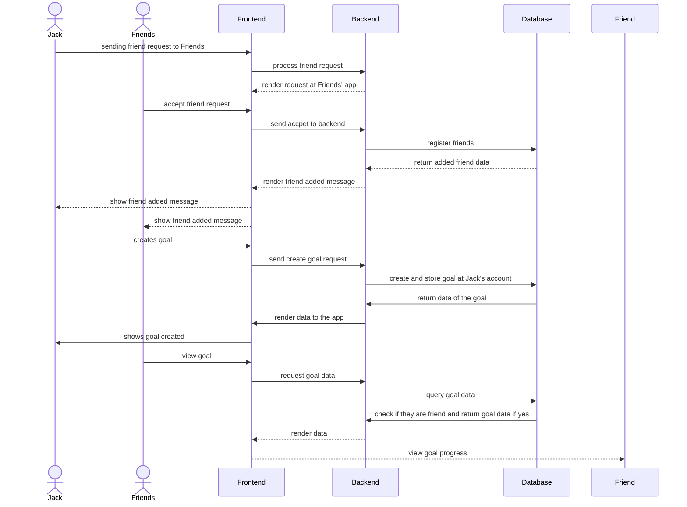

-Steps
  1. add friends
  2. accepted friend request
  3. create goals
  4. view progress

```mermaid
sequenceDiagram
  actor Jack
  actor Friends
  participant Frontend
  participant Backend
  participant Database
  Jack ->> Frontend: sending friend request to Friends
  Frontend ->> Backend: process friend request
  Backend -->> Frontend: render request at Friends' app
  Friends ->> Frontend: accept friend request
  Frontend ->> Backend: send accpet to backend
  Backend ->> Database: register friends
  Database -->> Backend: return added friend data
  Backend -->> Frontend: render friend added message
  Frontend -->> Jack: show friend added message
  Frontend -->> Friends: show friend added message
  Jack ->> Frontend: creates goal
  Frontend ->> Backend: send create goal request
  Backend ->> Database: create and store goal at Jack's account
  Database ->> Backend: return data of the goal
  Backend ->> Frontend: render data to the app
  Frontend ->> Jack: shows goal created
  Friends ->> Frontend: view goal
  Frontend ->> Backend: request goal data
  Backend ->> Database: query goal data
  Database ->> Backend: check if they are friend and return goal data if yes
  Backend -->> Frontend: render data
  Frontend  -->> Friend: view goal progress
```
