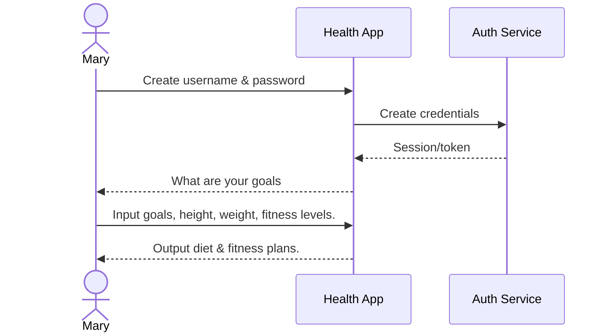
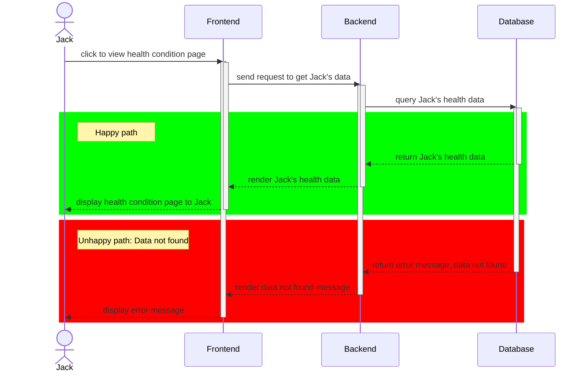

`

``` mermaid
sequenceDiagram
    actor Mary
    Participant Health App
    Participant Auth Service
    Mary->>Health App:  Create username & password
    Health App->>Auth Service: Create credentials
    Auth Service-->>Health App: Session/token
    Health App-->>Mary: What are your goals
    Mary->>Health App: Input goals, height, weight, fitness levels.
    Health App-->>Mary: Output diet & fitness plans.
```

```mermaid
sequenceDiagram
    actor Jack
    participant Frontend
    participant Backend
    participant Database
    Jack ->> Frontend: click to view health condition page
    activate Frontend
    activate Frontend
    Frontend ->> Backend: send request to get Jack's data
    activate Backend
    activate Backend
    Backend ->> Database: query Jack's health data
    activate Database
    activate Database
    rect rgb(0, 255, 0)
    Note right of Jack: Happy path
    Database -->> Backend: return Jack's health data
    deactivate Database
    Backend -->> Frontend: render Jack's health data
    deactivate Backend
    Frontend -->> Jack: display health condition page to Jack
    deactivate Frontend
    end
    rect rgb(255, 0, 0)
    Note right of Jack: Unhappy path: Data not found
    Database -->> Backend: return error message, data not found
    deactivate Database 
    Backend -->> Frontend: render data not found message
    deactivate Backend
    Frontend -->> Jack: display error message
    deactivate Frontend
    end
```

    
   
      
    
    
