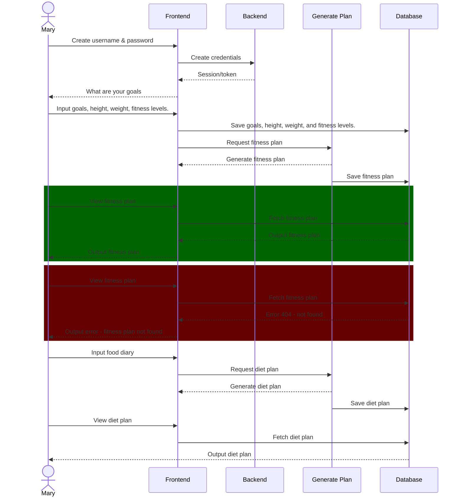
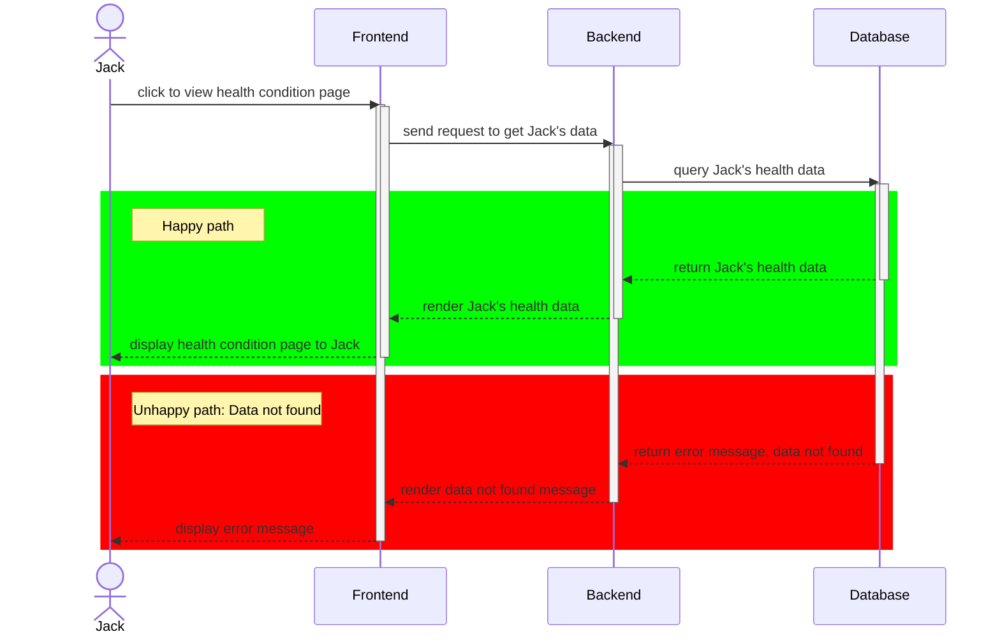

`

``` mermaid
sequenceDiagram
    actor Mary
    Participant Frontend
    Participant Backend
    Participant Generate Plan
    Participant Database


    Mary->>Frontend:  Create username & password
    Frontend->>Backend: Create credentials
    Backend-->>Frontend: Session/token
    Frontend-->>Mary: What are your goals
    Mary->>Frontend: Input goals, height, weight, fitness levels.
    Frontend->>Database: Save goals, height, weight, and fitness levels.
    Frontend->>Generate Plan: Request fitness plan
    Generate Plan-->>Frontend: Generate fitness plan
    Generate Plan->>Database: Save fitness plan

    rect rgb(0,100,0)
    Mary->>Frontend: View fitness plan
    Frontend->>Database:Fetch fitness plan
    Database-->>Frontend: Output fitness plan
    Frontend-->>Mary: Output fitness plan
    end

    rect rgb(100,0,0)
    Mary->>Frontend:View fitness plan
    Frontend->>Database:Fetch fitness plan
    Database-->>Frontend: Error 404 - not found
    Frontend-->>Mary: Output error - fitness plan not found
    end

    Mary->>Frontend: Input food diary
    Frontend->>Generate Plan: Request diet plan
    Generate Plan-->>Frontend: Generate diet plan
    Generate Plan->>Database: Save diet plan
    Mary->>Frontend: View diet plan
    Frontend->>Database: Fetch diet plan
    Database-->>Mary: Output diet plan
    
```

```mermaid
sequenceDiagram
    actor Jack
    participant Frontend
    participant Backend
    participant Database
    Jack ->> Frontend: click to view health condition page
    activate Frontend
    activate Frontend
    Frontend ->> Backend: send request to get Jack's data
    activate Backend
    activate Backend
    Backend ->> Database: query Jack's health data
    activate Database
    activate Database
    rect rgb(0, 255, 0)
    Note right of Jack: Happy path
    Database -->> Backend: return Jack's health data
    deactivate Database
    Backend -->> Frontend: render Jack's health data
    deactivate Backend
    Frontend -->> Jack: display health condition page to Jack
    deactivate Frontend
    end
    rect rgb(255, 0, 0)
    Note right of Jack: Unhappy path: Data not found
    Database -->> Backend: return error message, data not found
    deactivate Database 
    Backend -->> Frontend: render data not found message
    deactivate Backend
    Frontend -->> Jack: display error message
    deactivate Frontend
    end
```

    
   
      
    
    
